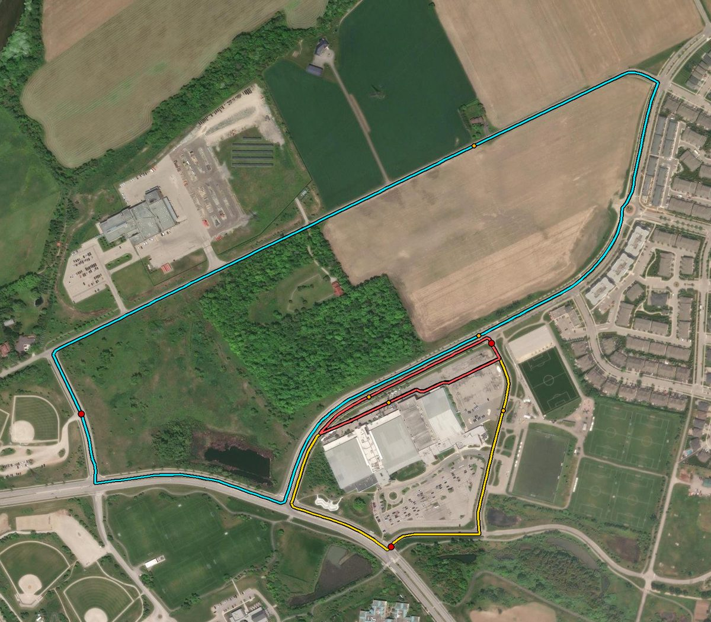

# Track Generator

Builds closed-loop race tracks around **RIM Park, Waterloo ON** and renders them
as map overlays you can embed on the website.

## Real GPS data for RIM Park

| Field | Value |
|-------|-------|
| Name | RIM Park |
| Address | 2001 University Ave E, Waterloo, ON N2K 4K4, Canada |
| Centroid | **43.5168813, -80.4964103** |
| OSM relation | [9062632](https://www.openstreetmap.org/relation/9062632) |
| Bounding box | lat `43.5124482` – `43.5216242`, lon `-80.5135042` – `-80.4910992` |

Stored machine-readable in [`rim_park_location.json`](./rim_park_location.json).

## The three circuits

All three follow **real road centrelines from OpenStreetMap**, so they lie exactly
on pavement when overlaid on satellite imagery.

| Key | Length | Corners | Roads used |
|-----|--------|---------|------------|
| `sprint` | 774 m | 3 | Millennium Blvd (up one carriageway, back the other) |
| `club` | 1220 m | 7 | Millennium Blvd → Park Rd → University Ave E — loops the Sportsplex |
| `grand` | 2962 m | 4 | Country Squire Rd + Millennium Blvd + University Ave E |

`club` is the loop visible in the reference screenshot and the best default for a demo:
long enough for real lap/sector timing, short enough to walk in a few minutes.



*Verification render — tracks composited over Esri World Imagery to confirm every
point lands on real pavement.*

## Usage

```bash
# 1. Build tracks from real OSM road geometry (uses osm_roads_cache.json if present)
python3 build_tracks_from_osm.py
python3 build_tracks_from_osm.py --refresh    # re-query Overpass

# 2. Render the map overlays
python3 export_map_embed.py --dir tracks --api-key YOUR_GOOGLE_MAPS_KEY
```

### Outputs

| File | Purpose |
|------|---------|
| `tracks/track_<key>.json` | Track in the RaceMind `track_points` shape (`seq`, `lat`, `lon`, `point_type`, `label`) — ready to seed the DB |
| `tracks/track_<key>.gpx` | Standard GPX, importable into any mapping/GPS tool |
| `tracks/preview.svg` | Dependency-free shape preview |
| `map_google.html` | **Google Maps overlay — embed this on the website** |
| `map_leaflet.html` | Same overlay on free Esri/OSM tiles, **no API key needed** |

Both map files are fully self-contained — GPS coordinates are inlined, nothing is
fetched at runtime except basemap tiles.

## Embedding on the website

Simplest is an iframe:

```html
<iframe src="/map_google.html" style="width:100%;height:520px;border:0"
        title="RaceMind track map"></iframe>
```

To inline it into an existing page instead, copy the `#map` div, the `<style>`
block, and the two `<script>` blocks from `map_google.html`.

**The Google version needs an API key** — enable *Maps JavaScript API*, create a
key, and restrict it to your domain (see [`docs/map-technology.md`](../../docs/map-technology.md)).
Without a key the map still renders but carries a "for development purposes only"
watermark. `map_leaflet.html` needs no key at all and is the quickest way to check
the overlay locally.

Each track can be toggled by clicking its legend row.

## How the circuit finder works

1. Fetch `highway=*` ways in a bbox around RIM Park from Overpass (with mirror fallback).
2. Build an undirected graph, snapping shared way endpoints to merge intersections.
3. Reduce to the 2-core, dropping dead-end spurs that can't be part of any loop.
4. Enumerate fundamental cycles: remove each edge, then find the shortest path
   between its endpoints — that path plus the edge is a genuine closed road circuit.
5. Match circuits against the presets in `build_tracks_from_osm.py` by required
   road names and target length, then resample at even spacing and tag
   start/finish + sector boundaries.

Adjust the `PRESETS` list to add or retarget circuits.

## `generate_tracks.py` (superseded)

The original procedural generator — fits a Catmull-Rom spline through randomized
control points to make synthetic loop shapes. It does **not** follow real roads, so
its output floats over fields and buildings. Kept for reference only; prefer
`build_tracks_from_osm.py`. Note it writes to the same `tracks/` directory and will
overwrite the real tracks if you run it.

## Before race day

These circuits are OSM road centrelines, which is plenty for building and testing.
For the real run, capture the track with the mobile app's own trace-track flow
(walk it once with GPS at 10 Hz) — see [`docs/mobile-app.md`](../../docs/mobile-app.md)
Screen 2 and [`docs/map-technology.md`](../../docs/map-technology.md). That trace is
the source of truth for the actual racing line.
